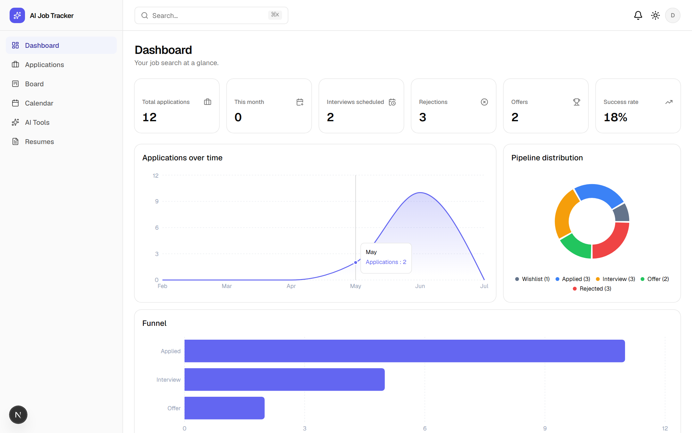
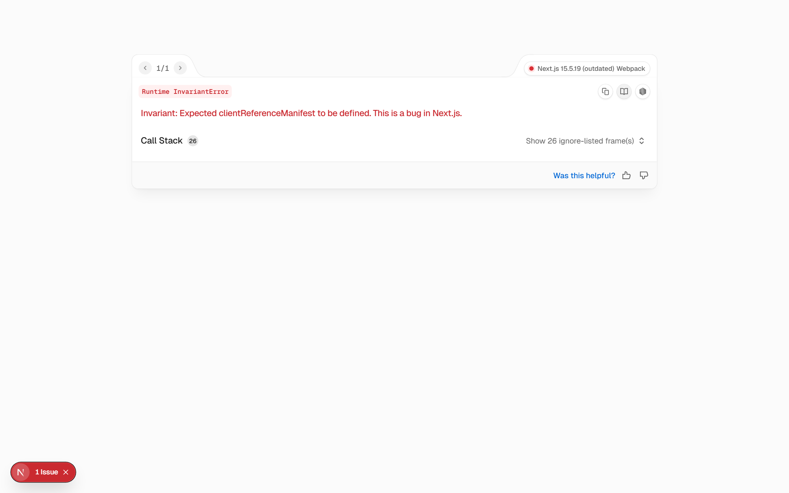
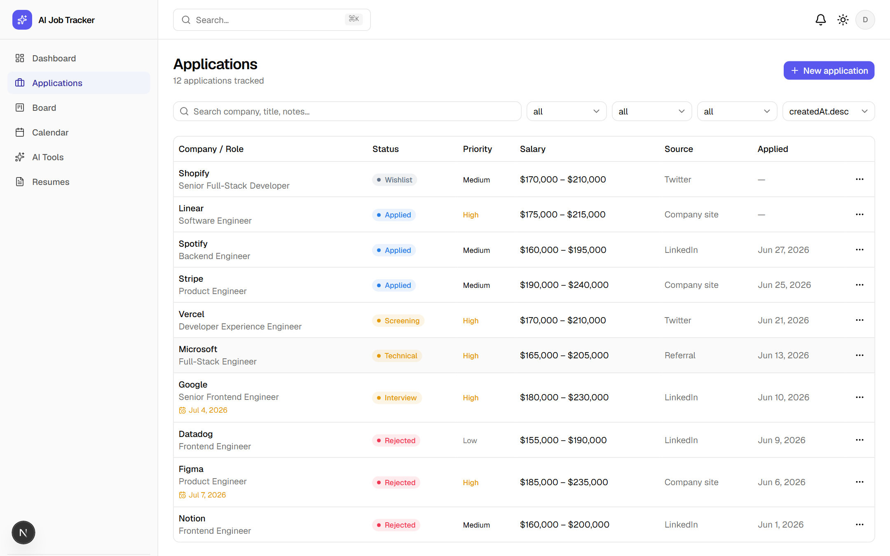
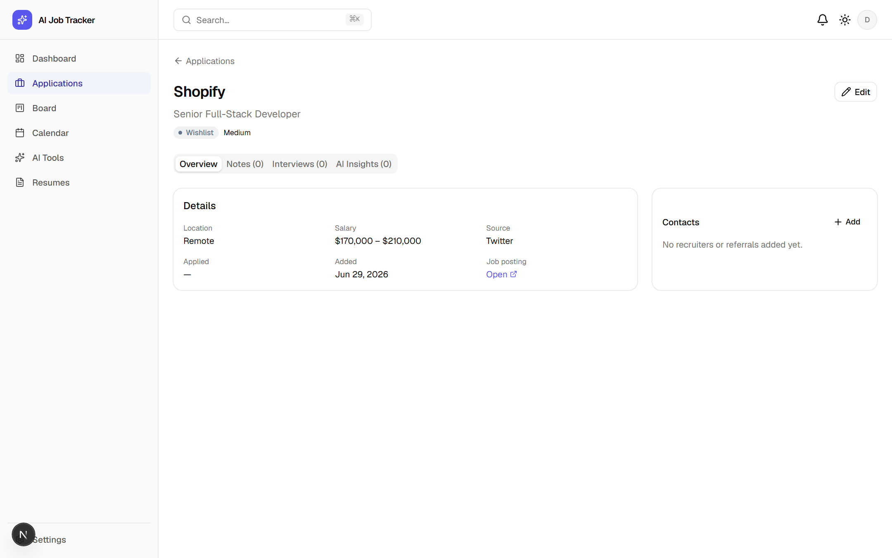
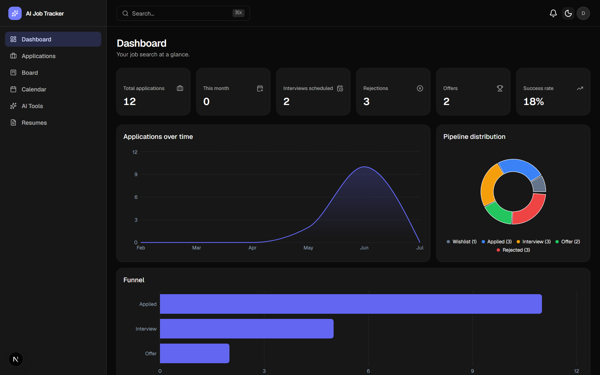
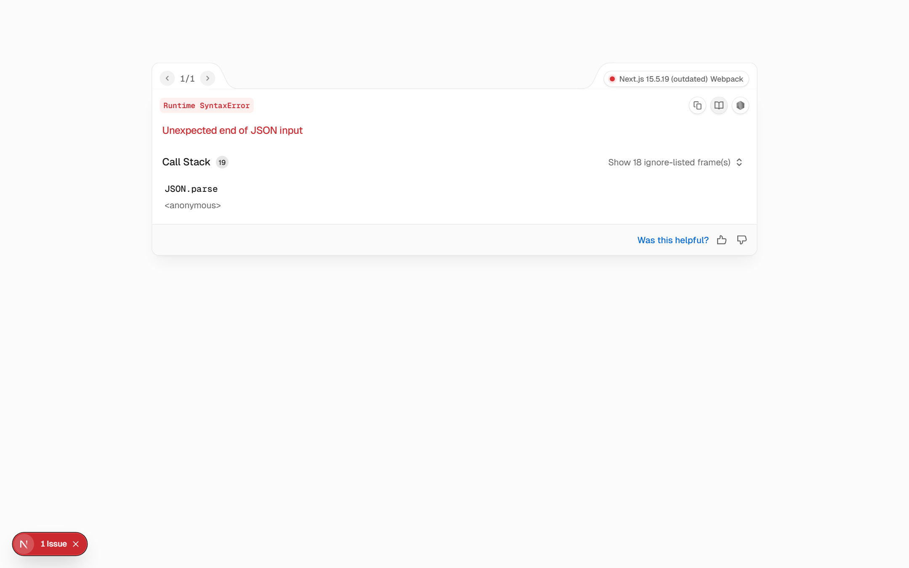

<div align="center">

# ✨ AI Job Tracker

**An AI-powered job application tracking platform** — organize your search, drag applications through a Kanban pipeline, and let AI analyze job descriptions, find resume gaps, write cover letters, and prep you for interviews.

[](https://github.com/Rellance/ai-job-tracker/actions/workflows/ci.yml)


_Built document-first: five design documents were written and reviewed before a single line of code._

[Documentation](./docs) · [Roadmap](#-roadmap) · [Getting started](#-getting-started) · [Architecture](#-architecture)

</div>

---

## 📸 Screenshots

### Dashboard — analytics at a glance

Stat cards, applications-over-time, pipeline distribution, funnel, and a live activity feed — all computed from real data.



### Kanban board — drag your pipeline

Drag-and-drop between five pipeline stages with optimistic updates, transactional persistence, and screen-reader announcements. Nine detailed statuses (Screening, Technical, Final…) collapse into five columns.



### Applications — search, filter, manage

URL-synced search / filters / sorting / pagination, and a detail page with Overview · Notes · Interviews · AI Insights tabs.





### First-class dark mode

<table>
  <tr>
    <td></td>
    <td></td>
  </tr>
</table>

---

## 🚀 Features

### Shipped

- 🔐 **Authentication** — Auth.js v5 (credentials), bcrypt hashing, single-use hashed password-reset tokens (60-min TTL), protected routes via middleware + server-side session checks
- 📋 **Application management** — full CRUD, debounced search across company/title/notes, filters (status / priority / source), sorting, server-side pagination — all URL-synced (shareable, back-button safe)
- 🗂️ **Kanban pipeline** — dnd-kit drag-and-drop, optimistic UI with rollback, keyboard-accessible, `aria-live` move announcements
- 📊 **Analytics dashboard** — success rate, funnel (Applied → Interview → Offer), applications over time, pipeline distribution (Recharts)
- 📝 **Notes & contacts** — typed pinnable notes (General / Interview / Follow-up), recruiter contacts per application
- 🧾 **Audit trail** — every significant mutation emits an immutable `ActivityEvent`; one append-only stream powers the activity feed, the audit log, _and_ analytics timing

### In progress / planned (see [roadmap](#-roadmap))

- 📅 **Calendar** — interviews, follow-ups, deadlines, reminders
- 🤖 **AI Workspace** — JD analyzer, resume gap analysis, match score, cover letter generator (streaming), interview prep — all as background jobs with structured, schema-validated output
- 📄 **Resume versions** — upload, parse, reuse across AI tools
- 💳 **Billing** — Stripe (test-mode) with FREE / PRO / ENTERPRISE plans and AI quotas

---

## 🛠 Tech stack

| Layer                  | Technology                                                          |
| ---------------------- | ------------------------------------------------------------------- |
| **Framework**          | Next.js 15 (App Router) · React 19 · TypeScript (strict)            |
| **UI**                 | Tailwind CSS v4 · shadcn/ui (Base UI) · Recharts · dnd-kit · Sonner |
| **Forms & validation** | React Hook Form · Zod (shared client + server schemas)              |
| **Database**           | PostgreSQL (Supabase) · Prisma 6                                    |
| **Auth**               | Auth.js v5 — JWT strategy, credentials provider, OAuth-ready schema |
| **AI** _(M4)_          | OpenAI structured outputs, model tiering, input-hash caching        |
| **Jobs** _(M4)_        | BullMQ + Redis, dedicated worker process                            |
| **Billing** _(M5)_     | Stripe Checkout + webhooks (test-mode)                              |
| **Infra**              | Docker (multi-stage) · docker-compose · GitHub Actions CI           |
| **Testing**            | Vitest (unit) · Playwright (E2E)                                    |

---

## 🏗 Architecture

```
                        Browser (RSC + client components)
                                      │
       ┌──────────────────────────────┼────────────────────────────┐
       │                    Next.js  "web"                          │
       │  Server Components ─ reads                                 │
       │  Server Actions ──── mutations (CRUD)                      │
       │  Route Handlers ──── AI enqueue · webhooks · auth          │
       │            │                                               │
       │      lib/services  ←— the only place business logic        │
       │      lives; every query scoped by userId                   │
       └────────────┬───────────────────────────┬──────────────────┘
                    │                           │ enqueue
              PostgreSQL                     Redis (BullMQ)
              (Prisma)                          │ consume
                    ▲                    ┌──────┴──────┐
                    └────────────────────┤   "worker"  │──► OpenAI / R2 / Resend
                                         └─────────────┘
```

**Key decisions** (full rationale in [`docs/02-system-design.md`](docs/02-system-design.md)):

- **CRUD → Server Actions, AI/streaming/webhooks → Route Handlers** — one rule, no duplicated REST layer
- **Service layer** (`src/lib/services`) is the only place business logic and Prisma live; handlers and actions are thin glue
- **AI artifacts are first-class** — created standalone in the AI Workspace, then attached to applications
- **One append-only `ActivityEvent` table** powers audit log + activity feed + analytics timing (response time, ghosted rate)
- **Tenant isolation** — every query is `userId`-scoped; cross-tenant access returns 404, never 403

📚 **Design docs:** [PRD](docs/01-PRD.md) · [System Design](docs/02-system-design.md) · [Database Design](docs/03-database-design.md) · [UI Spec](docs/04-frontend-ui-spec.md) · [Implementation Plan](docs/05-implementation-plan.md)

---

## 🗺 Roadmap

- [x] **Docs** — PRD, system design, database design, UI spec, implementation plan
- [x] **M0 — Foundation** — scaffold, Prisma schema + migrations + seed, design tokens, app shell, Docker, CI
- [x] **M1 — Authentication** — register / login / logout, password reset, protected routes, security headers
- [x] **M2 — Applications & Notes** — CRUD, URL-synced list, detail tabs, notes, contacts, unit tests
- [ ] **M3 — Board, Calendar, Dashboard** _(in progress — board ✅, dashboard ✅, calendar ⏳)_
- [ ] **M4 — AI Workspace** — JD analyzer, resume gap, match score, cover letters (streaming), interview prep; BullMQ worker, resume upload + parsing
- [ ] **M5 — Billing & Hardening** — Stripe test-mode, rate limiting, Sentry, a11y pass, E2E suite
- [ ] **M6 — Ship** — production deploy guide, final polish

---

## 🏁 Getting started

### Prerequisites

- Node.js 20+ (22 LTS recommended)
- A PostgreSQL database — [Supabase](https://supabase.com) free tier works great
- _(from M4)_ Redis ([Upstash](https://upstash.com)) and an OpenAI API key

### Setup

```bash
git clone https://github.com/Rellance/ai-job-tracker.git
cd ai-job-tracker
npm install

cp .env.example .env      # fill in DATABASE_URL, NEXTAUTH_SECRET, AUTH_SECRET

npm run db:migrate        # create the schema
npm run db:seed           # demo user + 12 sample applications

npm run dev               # http://localhost:3000
```

**Demo login:** `demo@aijobtracker.dev` / `demo1234`

> **Supabase tip:** use the _transaction pooler_ URL (port 6543, `?pgbouncer=true`) as `DATABASE_URL` and the _session pooler_ URL (port 5432) as `DIRECT_URL` — the direct `db.<ref>.supabase.co` host is IPv6-only.

### Docker (full local parity)

```bash
docker compose up --build
```

Brings up `web`, `worker`, `postgres`, `redis`, and `mailpit` (dev inbox at http://localhost:8025).

### Scripts

| Command                                        | Purpose            |
| ---------------------------------------------- | ------------------ |
| `npm run dev`                                  | Dev server         |
| `npm test`                                     | Vitest unit tests  |
| `npm run typecheck` / `lint` / `format`        | Code quality       |
| `npm run db:migrate` / `db:seed` / `db:studio` | Database workflows |

---

## 🧪 Quality

- **TypeScript strict** everywhere; Zod validation at every trust boundary (client UX + server trust, same schemas)
- **Unit tests** for the service layer: tenant scoping, filter building, event emission, validation edge cases
- **CI** on every push: lint → typecheck → format check → tests
- **Security:** hashed passwords, single-use reset tokens, userId-scoped queries, security headers, secrets validated at boot and never committed

---

## 📄 License

Portfolio project — all rights reserved. Feel free to read the code and design docs; please don't republish as your own.

---

<div align="center">
<sub>Designed and built document-first — five design docs, then code, one milestone at a time.</sub>
</div>
